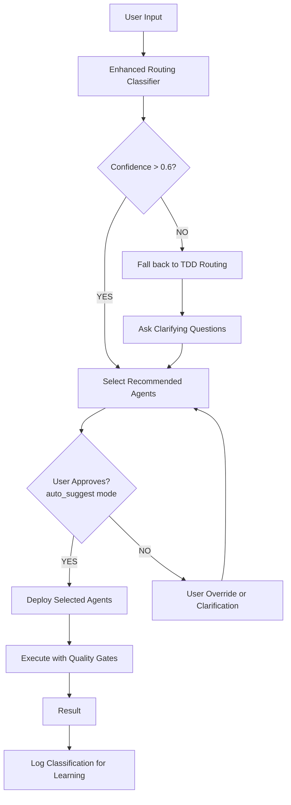

# Routing Integration Adapter

**Purpose:** Bridge between enhanced-routing-agent and existing tdd-routing-agent

## How They Work Together

```
User Input
    ↓
[Enhanced Routing Agent]
    ↓ (sends classification)
[Routing Integration Adapter] ← You are here
    ↓ (orchestrates)
[TDD Routing Agent + Selected Agents]
    ↓
Task Execution
```

## Integration Strategy

### Option A: Enhanced Agent as Pre-Processor (Recommended)
```
1. User message arrives
2. Enhanced routing analyzes it
3. Suggests agents to routing-agent
4. Routing-agent validates and executes
5. Quality gates apply as usual
```

**Advantage:** Non-invasive, existing system unchanged
**Best for:** Gradual adoption

### Option B: Enhanced Agent Replaces Base Router
```
1. User message arrives
2. Enhanced routing takes over
3. Enhanced routing calls specialized agents directly
4. Quality gates apply as usual
```

**Advantage:** Cleaner architecture
**Best for:** New projects or full replacement

### Option C: Hybrid Mode (Best of Both)
```
1. User message arrives
2. Try enhanced routing classification
3. If confidence > threshold: use enhanced routing
4. If confidence < threshold: fall back to base routing
5. Base routing asks user for clarification
```

**Advantage:** Safe fallback, best user experience
**Best for:** Production environments

## Implementation Steps

### Step 1: Update CLAUDE.md
Modify `config/CLAUDE.md` to activate enhanced routing:

```markdown
# Claude Code Behavioral Configuration

## Enhanced Routing (NEW)

Enable intelligent agent selection:

```json
{
  "enhanced_routing": {
    "enabled": true,
    "primary": true,
    "fallback": "tdd-routing-agent",
    "mode": "auto_suggest"
  }
}
```

## Agent Selection Priority (Updated)

1. **Check Enhanced Routing Classification** (NEW)
   - Analyze user intent
   - Calculate confidence scores
   - Select agents automatically

2. **Fall Back to TDD Routing** (if confidence < 0.6)
   - Ask clarifying questions
   - Use human judgment if needed

3. **Execute with Quality Gates**
   - TDD validation
   - Contract enforcement
```

### Step 2: Create Integration Hook
Add to `.claude/hooks/routing-classifier.sh`:

```bash
#!/bin/bash
# routing-classifier.sh
# Runs enhanced routing classification on user input

USER_INPUT="$1"

# Parse input for agent type indicators
classify_intent() {
    local input="$1"

    # Check for RED (testing) keywords
    if [[ $input =~ (test|validate|check|verify|bug|quality|make sure) ]]; then
        echo "RED"
        return 0
    fi

    # Check for ORANGE (orchestration) keywords
    if [[ $input =~ (deploy|migrate|pipeline|workflow|coordinate|automate) ]]; then
        echo "ORANGE"
        return 0
    fi

    # Check for GREEN (expertise) keywords
    if [[ $input =~ (build|create|write|develop|implement|optimize) ]]; then
        echo "GREEN"
        return 0
    fi

    # Ambiguous - return UNKNOWN
    echo "UNKNOWN"
    return 1
}

# Detect technologies
detect_technology() {
    local input="$1"

    for tech in React Python Go TypeScript Django Kubernetes Docker AWS Azure; do
        if [[ $input =~ $tech ]]; then
            echo "$tech"
            return 0
        fi
    done

    echo "GENERIC"
    return 1
}

# Main classification
INTENT=$(classify_intent "$USER_INPUT")
TECH=$(detect_technology "$USER_INPUT")

# Output results for routing system
cat <<EOF
{
  "intent": "$INTENT",
  "technology": "$TECH",
  "input": "$USER_INPUT",
  "timestamp": "$(date -u +%Y-%m-%dT%H:%M:%SZ)"
}
EOF
```

### Step 3: Update Task Executor
Modify how task-executor selects agents:

```python
# pseudo-code for integration

def execute_task(user_input, context):
    # Step 1: Classify intent
    classification = enhanced_router.classify(user_input)

    # Step 2: Get confidence scores
    confidence = classification['confidence_scores']

    if confidence['highest'] > 0.6:
        # Use enhanced routing
        agents = classification['recommended_agents']
        deploy_agents(agents, parallel=True)
    else:
        # Fall back to base routing
        base_router.handle(user_input, context)
```

## Configuration File Updates

### Update `.claude/settings.local.json`

```json
{
  "routing": {
    "enhanced": true,
    "auto_suggest": true,
    "show_confidence": true,
    "fallback_threshold": 0.6,
    "multi_agent_mode": true
  },
  "enhanced_routing": {
    "enabled": true,
    "mode": "auto_suggest",
    "confidence_threshold": 0.6,
    "multi_agent_threshold": 0.5,
    "show_confidence_scores": true,
    "suggest_alternatives": true,
    "fallback_agent": "tdd-routing-agent"
  }
}
```

### Create `.claude/routing-keywords.json`

```json
{
  "red": {
    "primary_keywords": ["test", "validate", "check", "verify", "quality"],
    "secondary_keywords": ["bug", "error", "assert", "should be", "make sure"],
    "weight": 0.4
  },
  "orange": {
    "primary_keywords": ["deploy", "migrate", "pipeline", "workflow", "coordinate"],
    "secondary_keywords": ["automate", "scale", "production", "go live"],
    "weight": 0.4
  },
  "green": {
    "primary_keywords": ["build", "create", "write", "develop", "implement"],
    "secondary_keywords": ["optimize", "refactor", "design", "architect"],
    "weight": 0.3
  },
  "technologies": {
    "frontend": ["React", "Vue", "Angular", "Next.js", "Svelte"],
    "backend": ["Python", "Go", "Rust", "Java", "Node.js", "Ruby"],
    "database": ["PostgreSQL", "MongoDB", "Redis", "MySQL"],
    "infrastructure": ["Kubernetes", "Docker", "Terraform", "AWS", "Azure", "GCP"]
  }
}
```

## Execution Flow with Integration



## Rollout Strategy

### Phase 1: Testing (Week 1)
```
- Enable enhanced routing in dev environment
- Test with example inputs
- Verify confidence scores are reasonable
- Check agent selection accuracy
```

### Phase 2: Auto-Suggest Mode (Week 2)
```
- Enable in primary environment
- Set mode: "auto_suggest"
- Users see suggestions before agents deploy
- Collect feedback on accuracy
```

### Phase 3: Auto-Deploy Mode (Week 3)
```
- Switch to mode: "auto"
- Agents deploy without asking
- Monitor for user overrides
- Fine-tune keywords if needed
```

### Phase 4: Production (Week 4+)
```
- Full auto routing in all environments
- Learning system active
- Continuous keyword optimization
- Maintenance and updates
```

## Monitoring and Metrics

Track these metrics to ensure quality:

```json
{
  "classification_accuracy": {
    "target": 0.85,
    "measure": "correct_agent_selected / total_classifications"
  },
  "user_acceptance": {
    "target": 0.90,
    "measure": "users_accepting_suggestions / total_suggestions"
  },
  "override_rate": {
    "target": 0.10,
    "measure": "users_overriding / total_classifications"
  },
  "avg_confidence_score": {
    "target": 0.75,
    "measure": "average of highest_confidence_score per request"
  }
}
```

## Fallback Plan

If enhanced routing fails:

```
1. System detects low confidence (< 0.3)
2. Falls back to tdd-routing-agent
3. Routing agent asks clarifying questions
4. User provides more context
5. System reclassifies and retries

NEVER breaks - always has fallback
```

## Testing Checklist

- [ ] Enhanced routing installed
- [ ] Keywords configured in routing-keywords.json
- [ ] Settings updated in settings.local.json
- [ ] Test Case 1: Testing task → RED agents
- [ ] Test Case 2: Orchestration → ORANGE agents
- [ ] Test Case 3: Building → GREEN agents
- [ ] Test Case 4: Multi-agent task → Multiple agent types
- [ ] Test Case 5: Ambiguous input → Falls back gracefully
- [ ] Confidence scores display correctly
- [ ] User override works
- [ ] Fallback to base routing works
- [ ] Quality gates still enforce validation
- [ ] No existing functionality broken

## Success Criteria

✅ System routes correctly 85%+ of the time
✅ Users accept suggestions 80%+ of the time
✅ No regression in quality or safety
✅ Fallback works smoothly
✅ Performance overhead < 100ms

## Next Steps

1. Install enhanced-routing-agent.md into agents/
2. Copy configuration files to .claude/
3. Add routing hooks
4. Run test cases
5. Monitor metrics
6. Fine-tune keywords based on usage
7. Enable auto-deploy when confident
